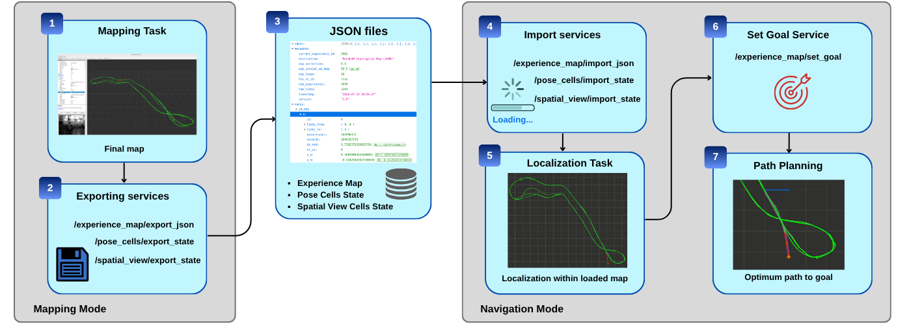
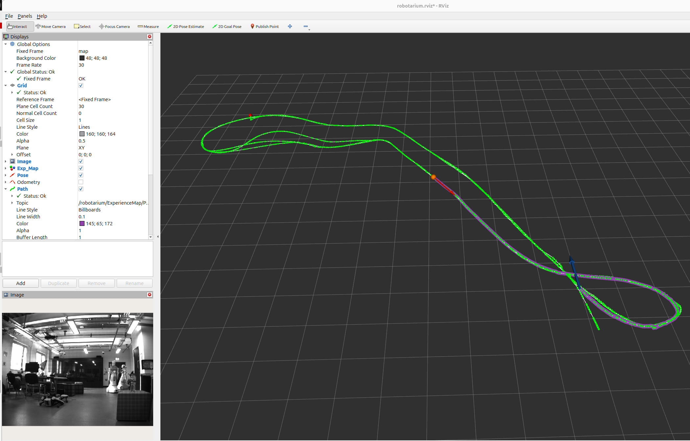

# neoslam

This package is a bio-inspired SLAM system for ROS 2 (tested on ROS 2 Jazzy) that combines deep learning visual features, Hierarchical Temporal Memory (HTM), and topological mapping for robust simultaneous localization and mapping.

## System Overview


neoslam implements a complete visual SLAM pipeline with the following components:

- **Visual Feature Extractor**: Extracts deep features from camera images using AlexNet (PyTorch)
- **Binary Projector**: Reduces dimensionality using Locality-Sensitive Binary Hashing (LSBH)
- **Neocortex (HTM)**: Learns temporal sequences using Hierarchical Temporal Memory
- **Spatial View Cells**: Performs visual place recognition and loop closure detection
- **Pose Cells**: Maintains pose estimation through continuous attractor network dynamics
- **Experience Map**: Builds and maintains a topological map with iterative refinement

## Dependencies

In addition to standard ROS 2 dependencies, this package requires:

### ROS 2 Packages
- `rclcpp`
- `std_msgs`
- `sensor_msgs`
- `geometry_msgs`
- `nav_msgs`
- `visualization_msgs`
- `tf2_ros`
- `tf2_geometry_msgs`
- `cv_bridge`
- `image_transport`
- `topological_msgs` (custom package - must be installed separately)

### System Libraries
- `OpenCV` (for image processing)
- `Eigen3` (for matrix operations)
- `Boost` (serialization component for HTM)
- `Irrlicht` (optional, for 3D visualization)
- `OpenGL` (optional, for visualization)
- `PyTorch` with CUDA (for deep learning feature extraction)
- `PyBind11` (for Python-C++ integration)
- `Roaring Bitmaps` (for efficient sparse representation)
- `Cereal` (for serialization)
- `Lark` (for parsing)

## Installation

### 1. Install ROS 2 Jazzy

First, install ROS 2 Jazzy on Ubuntu 24.04 following the official instructions:

```bash
# Add ROS 2 repository
sudo apt update && sudo apt install curl
sudo curl -sSL https://raw.githubusercontent.com/ros/rosdistro/master/ros.key -o /usr/share/keyrings/ros-archive-keyring.gpg
echo "deb [arch=$(dpkg --print-architecture) signed-by=/usr/share/keyrings/ros-archive-keyring.gpg] http://packages.ros.org/ros2/ubuntu $(lsb_release -cs) main" | sudo tee /etc/apt/sources.list.d/ros2.list > /dev/null

# Install ROS 2 Jazzy
sudo apt update
sudo apt install -y ros-jazzy-desktop python3-colcon-common-extensions

# Source ROS 2
echo "source /opt/ros/jazzy/setup.bash" >> ~/.bashrc
source ~/.bashrc
```

### 2. Install System Dependencies

Install the base packages and tools required by the system, including Python Virtual Environment support:

```bash
sudo apt update
sudo apt install -y \
    ros-jazzy-cv-bridge \
    ros-jazzy-image-transport \
    ros-jazzy-image-transport-plugins \
    ros-jazzy-tf2-geometry-msgs \
    ros-jazzy-vision-opencv \
    libopencv-dev \
    libboost-all-dev \
    libirrlicht-dev \
    libgl1-mesa-dev \
    libglu1-mesa-dev \
    libeigen3-dev \
    libroaring-dev \
    libcereal-dev \
    python3-opencv \
    python3-pip \
    python3-venv \
    python3-full \
    python3-numpy \
    python3-pybind11 \
    build-essential \
    cmake \
    git \
    wget
```

### 3. Configure Python Virtual Environment (PEP 668)

**IMPORTANT:** Ubuntu 24.04 enforces externally managed Python environments (PEP 668). To install PyTorch and maintain ROS 2 compatibility, create a virtual environment with system site packages:

```bash
# Create the virtual environment with system site packages
python3 -m venv --system-site-packages ~/ros2_env

# Activate the environment
source ~/ros2_env/bin/activate

# Verify the environment
which python3
# Should output: /home/usr/ros2_env/bin/python3
```
*(Optional)* To automatically activate the environment on new terminals, add to your `~/.bashrc` after sourcing ROS:

```bash
echo "source /opt/ros/jazzy/setup.bash" >> ~/.bashrc
echo "source ~/ros2_env/bin/activate" >> ~/.bashrc
```

### 4. Install Python Dependencies

With the virtual environment activated, install all required Python packages:

```bash
# Upgrade pip first
pip install --upgrade pip setuptools wheel

# Install PyTorch with CUDA support
pip install torch torchvision

# Install ROS 2 Python dependencies
pip install \
    empy \
    pyyaml \
    lark \
    pyparsing \
    rospkg \
    rosdistro \
    catkin-pkg \
    netifaces \
    defusedxml \
    distro \
    python-dateutil \
    importlib-metadata

# Install scientific computing libraries
pip install numpy scipy matplotlib

# Install OpenCV Python bindings
pip install opencv-python opencv-python-headless

# Install pybind11
pip install pybind11

# Install colcon tools
pip install colcon-common-extensions vcstool
```

### 5. Configure rosdep
```bash
sudo rosdep init
rosdep update
```

### 6. Clone Required Repositories

```bash
cd ~/ros2_jazzy_ws/src
git clone https://github.com/fjscoelho/neoslam.git
git clone https://github.com/BorgesJVT/topological_msgs.git
```

### 7. Generate Random Projection Matrix

The binary projector requires a random projection matrix. Generate it with:

```bash
cd ~/ros2_jazzy_ws/src/neoslam/src/dim_reduction_and_binarization/random_matrix
python3 generate_random_matrix.py --rows 64896 --cols 1024 --output randomMatrix.bin
```

### 8. Build the Workspace

**IMPORTANT:** Ensure your **virtual environment is active** before running the build command:

```bash
# Activate the virtual environment (if not already active)
source ~/ros2_env/bin/activate

# Build packages
cd ~/ros2_jazzy_ws
source /opt/ros/jazzy/setup.bash
colcon build --packages-select topological_msgs neoslam --symlink-install
```

### 9. Source the Workspace

```bash
source ~/ros2_jazzy_ws/install/setup.bash
```

## Usage

### Basic Launch

neoslam provides launch files for different datasets:

```bash

# For Robotarium dataset
ros2 launch neoslam robotarium.launch.py use_sim_time:=true
```
### Rviz Visualization

It's optional, but highly recommended for a better data visualization:

The RViz display includes:

- Topological Map: Nodes (experiences) and edges as a graph

- Robot Pose: Current position and orientation

- Goal Pose: Navigation target

- Planned Path: Sequence of nodes to traverse

**Robotarium Example:**  In a separate terminal (with the virtual environment activated), play your ROS 2 bag file:

```bash
# For Robotarium dataset
cd ~/ros2_jazzy_ws/src/neoslam/rviz/
rviz2 -d robotarium.rviz
```


### Playing Dataset Bags

In a separate terminal (with the virtual environment activated), play your ROS 2 bag file:

```bash
# For Robotarium dataset
ros2 bag play _2022-04-07-14-14-35_robotarium/_2022-04-07-14-14-35_robotarium_ros2.db3 --rate 1.0 --clock --start-paused --remap /stereo_camera/left/image_raw:=/robotarium/camera/image /odometry/filtered:=/robotarium/odom

# Adjust rate as needed (1.0 = real-time, 2.0 = 2x speed, etc.)
```
Obs.: Remappings are necessary to align the image and odometry descriptions with the names expected by NeOSLAM. The expected topic names are `/topic_root/camera/image` and `/topic/odom`, where `topic_root` is passed as a parameter in the `.config` configuration file.

<!-- ### Acknowledgments
This project builds upon previous work in bio-inspired robotics and neuromorphic computing. Special thanks to the contributors of the HTM algorithms and the ROS community. -->


## Advanced Features - New NeoSLAM workflow: 

A persistent NeoSLAM workflow that connects mapping, state export/import, frozen-map localization, and topological global planning in ROS 2.


1. In **Mapping Node**, as the robot explores a new environment, the system adds new
experiences. When the robot passes through a previously visited location, a loop closure occurs, and the entire map is updated
to correct odometric drift.; 
2. Once mapping is complete, the user can export both the map and the complete system state;
3. The data are stored as human-readable JSON files; 
4. **Navigation Mode** – After the environment has been mapped, the user can launch a new application, switch to navigation mode, and import the saved files; 
5. In the Localization task, the robot localizes itself within the experience map but no longer modifies it; 
6. The operator can specify a goal location, and 
7. the Path Planner algorithm computes the optimal route to that goal within the experience map.

### Export and Import Map Data

neoslam allows you to export the entire state of the SLAM system, including pose cells, spatial view cells, and the topological experience map. This enables you to save maps for later use or share them between different runs.

#### Exporting system state

After finishing the mapping task you can export the final map, and the states of posecells and spatial_view_cells:

```bash
# Export the map to the default location (/neoslam_exported_states)
ros2 ros2 service call /experience_map/export_json std_srvs/srv/Empty
# Export pose_cells state
ros2 service call /pose_cells/export_state std_srvs/srv/Empty
# Export spatial_view_cells state
ros2 service call /spatial_view/export_state std_srvs/srv/Empty
```
The export creates the following files:
- `topic_root_map.json`. 
- `topic_root_pose_cells_state.json`
- `topic_root_spatial_view_state.json`

Example: robotarium_map.json, robotarium_pose_cells_state.json and robotarium_spatial_view_state.json.

#### Importing system state

Once mapped, you can restart the NeoSLAM and retrive the system state. You must import the three files to restore the complete state of the system:

```bash
# Import services
ros2 ros2 service call /experience_map/import_map neoslam/srv/ImportMap "{filename: 'map_xxxxxx.json'}"
ros2 service call /pose_cells/import_state std_srvs/srv/Empty
ros2 service call /spatial_view/import_state std_srvs/srv/Empty
```

#### Changing to Navigation Mode

In Navigation mode, the system uses the map to localize within it without modifying the map itself. To use Navigation mode:

```bash
ros2 service call /change_mode std_srvs/srv/SetBool "{data: true}"
```

### Path Planning

You can send goal poses for path planning. Example:

```bash
# via topic
ros2 topic pub /robotarium/ExperienceMap/SetGoalPose geometry_msgs/msg/PoseStamped "{header: {frame_id: 'map'}, pose: {position: {x: 0.0, y: 1.0, z: 0.0}, orientation: {x: 0.0, y: 0.0, z: 0.707, w: 0.707}}}" --once

# or via service
ros2 service call /experience_map/set_goal neoslam/srv/SetGoal "{x: 0.0, y: 1.0}"
```

Example:


### License
The GLP-3 License. See the [LICENSE](LICENSE) for details.

### Citation
If you use this package in your research, please cite: